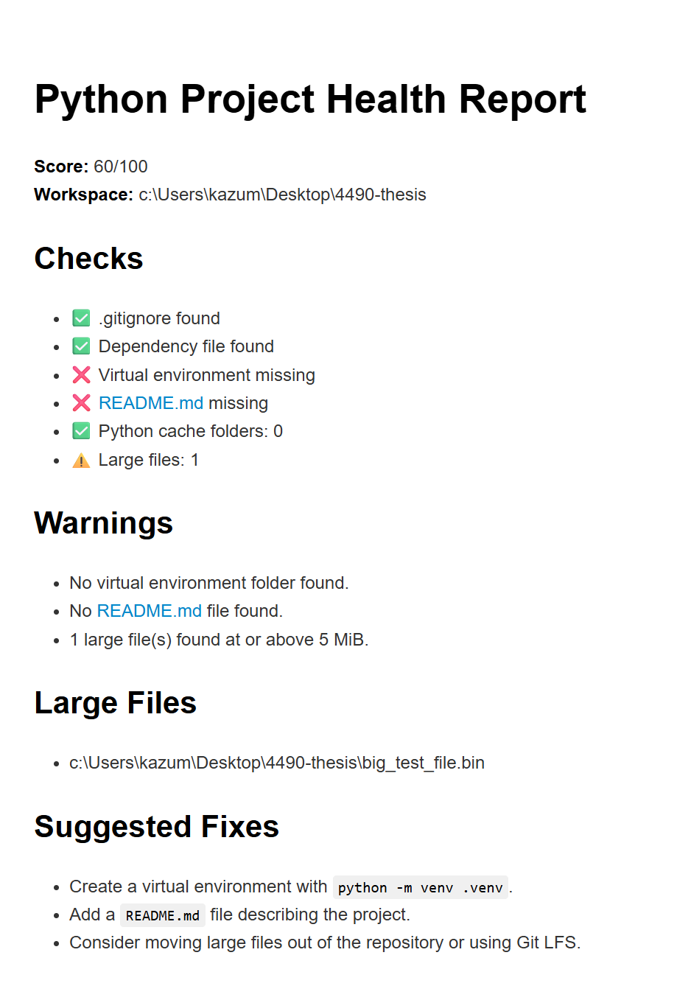
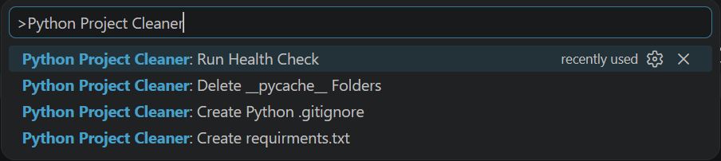
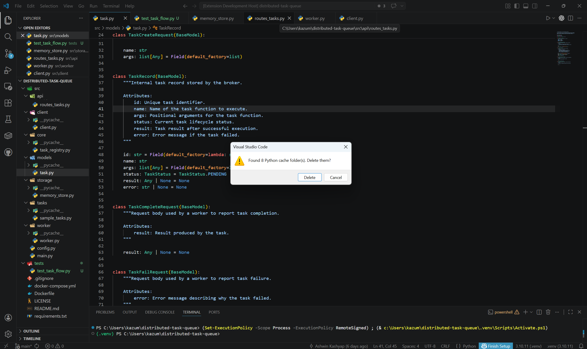
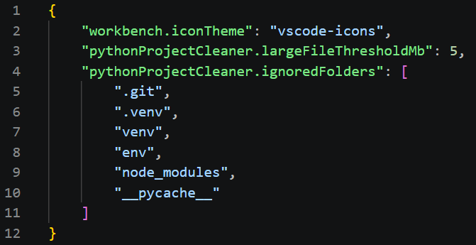

# Python Project Cleaner

Python Project Cleaner is a VS Code extension that scans a Python workspace and generates a simple project health report.

**[Install from the VS Code Marketplace](https://marketplace.visualstudio.com/items?itemName=ashkash04.python-project-cleaner)**

This extension is a developer tool for scanning Python workspaces and identifying common project hygiene issues, including dependency file detection, virtual environment detection, Python cache folder detection, README detection, large file detection, and basic cleanup commands.

## Features

### Run Python Project Health Check

The extension adds the command:

```text
Python Project Cleaner: Run Health Check
```

The health check scans the currently opened workspace and reports:

- Whether a `.gitignore` file exists
- Whether a Python dependency file exists:
  - `requirements.txt`
  - `pyproject.toml`
- Whether a virtual environment folder exists:
  - `.venv`
  - `venv`
  - `env`
- Whether a `README.md` file exists
- How many `__pycache__` folders were found
- How many large files at or above the configured threshold were found
- A calculated project health score
- A list of warnings
- Suggested fixes for detected issues

The report opens as a Markdown document inside VS Code.

### Delete Python Cache Folders

The extension adds the command:

```text
Python Project Cleaner: Delete __pycache__ Folders
```

This command scans the workspace for `__pycache__` folders, asks for confirmation, and deletes the detected folders.

### Create Python .gitignore

The extension adds the command:

```text
Python Project Cleaner: Create Python .gitignore
```

This command creates a starter `.gitignore` file for a typical Python project if one does not already exist.

### Create requirements.txt

The extension adds the command:

```text
Python Project Cleaner: Create requirements.txt
```

This command creates a starter `requirements.txt` file if neither `requirements.txt` nor `pyproject.toml` already exists.

## Screenshots

### Health Report

The health check opens a Markdown report with a score, detected issues, warnings, large files, and suggested fixes.



### Command Palette

All extension actions are available from the VS Code Command Palette.



### Safe Cache Cleanup

The cache cleanup command asks for confirmation before deleting detected `__pycache__` folders.



### Configuration

The extension supports configurable large file thresholds and ignored folders.



## Example Health Report

```md
# Python Project Health Report

**Score:** 65/100
**Workspace:** C:\Users\example\Desktop\my-python-project

## Checks

- ✅ .gitignore found
- ✅ Dependency file found
- ❌ Virtual environment missing
- ✅ README.md found
- ⚠️ Python cache folders: 2
- ⚠️ Large files: 1

## Warnings

- No virtual environment folder found.
- 2 Python cache folder(s) found.
- 1 large file(s) found at or above 10 MiB.

## Large Files

- C:\Users\example\Desktop\my-python-project\data\sample_video.mp4

## Suggested Fixes

- Create a virtual environment with `python -m venv .venv`.
- Run `Python Project Cleaner: Delete __pycache__ Folders`.
- Consider moving large files out of the repository or using Git LFS.
```

## Requirements

This extension does not require any external dependencies to use.

It works on Python project folders opened in VS Code.

## Extension Settings

This extension contributes the following settings:

- `pythonProjectCleaner.largeFileThresholdMb`: Minimum file size in MiB for a file to be reported as large. Default: `10`.
- `pythonProjectCleaner.ignoredFolders`: Folder names to skip while scanning the workspace. Default: `.git`, `.venv`, `venv`, `env`, `node_modules`, `__pycache__`.

## Known Issues

- The extension scans folders synchronously, so very large workspaces may take longer to analyze.
- The health score is heuristic and should be treated as a general project hygiene estimate, not a definitive quality score.
- Large file detection is based on file size only and does not determine whether a large file is intentionally tracked.
- The extension detects whether dependency files exist, but it does not yet validate dependency correctness.
- The extension does not yet analyze Python imports, auto-generate dependency lists, or detect unused dependencies.

## Roadmap

Planned future improvements:

- Dependency import analysis
- Unused dependency detection
- Optional requirements.txt generation from detected imports
- Additional project structure checks
- More configurable health scoring

## Release Notes

See [CHANGELOG.md](./CHANGELOG.md) for full version history.

Current release: `1.0.0`

## License

This project is licensed under the MIT License. See [LICENSE](./LICENSE) for details.
