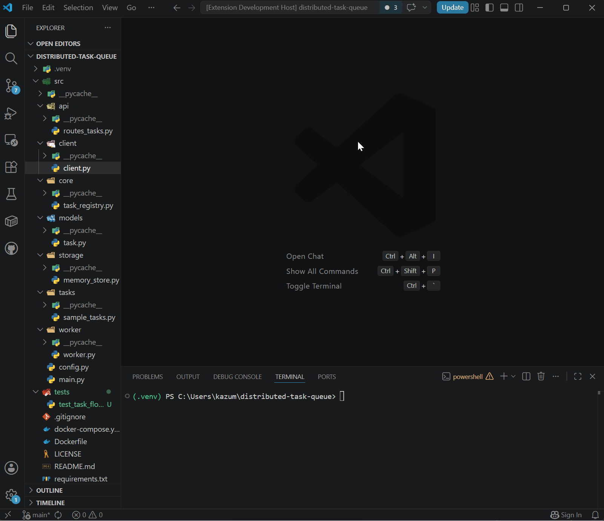

# Python Project Cleaner

**Python Project Cleaner** is a VS Code extension that scans Python workspaces and generates a simple project health report.

It helps catch common project cleanup issues like missing `.gitignore` files, missing dependency files, `__pycache__` folders, large files, missing README files, and possible dependency mismatches.

**[Install from the VS Code Marketplace](https://marketplace.visualstudio.com/items?itemName=ashkash04.python-project-cleaner)**

---

## Overview

Python Project Cleaner is built for developers who want a quick way to inspect the structure and hygiene of a Python project directly inside VS Code.

It currently checks for:

- Missing `.gitignore`
- Missing `requirements.txt` or `pyproject.toml`
- Missing virtual environment folder
- Missing `README.md`
- Python `__pycache__` folders
- Large files at or above a configurable threshold
- Possible missing dependencies based on Python imports
- Possible unused dependencies listed in `requirements.txt`

It also includes helper commands to clean up cache folders and generate starter project files.

---

## Demo



## Screenshots

### Safe Cache Cleanup

Cache cleanup asks for confirmation before deleting detected `__pycache__` folders.


### Configuration

Large file thresholds and ignored folders can be configured from VS Code settings.


---

## Features

### Project Health Report

Run:

```text
Python Project Cleaner: Run Health Check
```

The report includes:

- Project health score
- Detected project hygiene issues
- Warning summary
- Suggested fixes
- Large file report
- Dependency analysis report

### Cache Folder Cleanup

Run:

```text
Python Project Cleaner: Delete __pycache__ Folders
```

Scans the workspace for Python `__pycache__` folders and deletes them after confirmation.

### Starter `.gitignore` Generator

Run:

```text
Python Project Cleaner: Create Python .gitignore
```

Creates a starter Python `.gitignore` file if one does not already exist.

### Starter `requirements.txt` Generator

Run:

```text
Python Project Cleaner: Create requirements.txt
```

Creates a starter `requirements.txt` file if neither `requirements.txt` nor `pyproject.toml` exists.

### Dependency Analysis

Python Project Cleaner compares imports found in `.py` files against dependencies listed in `requirements.txt`.

It can report:

- Possible missing dependencies
- Possible unused dependencies

These results are marked as **possible** because static dependency analysis can produce false positives.

---

## Example Report

```md
# Python Project Health Report

**Score:** 75/100
**Workspace:** C:\Users\example\Desktop\my-python-project

## Checks

- ✅ .gitignore found
- ✅ Dependency file found
- ✅ Virtual environment found
- ✅ README.md found
- ⚠️ Python cache folders: 2
- ✅ Large files: 0

## Warnings

- 2 Python cache folder(s) found.
- 1 possible missing dependency issue(s) found.

## Suggested Fixes

- Run `Python Project Cleaner: Delete __pycache__ Folders`.
- Review possible missing dependencies and add them to `requirements.txt` if needed.

## Dependency Analysis

### Imported Packages

- fastapi
- pydantic
- requests

### Listed Dependencies

- fastapi
- pydantic

### Possible Missing Dependencies

- requests

### Possible Unused Dependencies

None found.
```

---

## Extension Settings

Python Project Cleaner contributes the following settings:

| Setting | Description | Default |
|---|---|---|
| `pythonProjectCleaner.largeFileThresholdMb` | Minimum file size in MiB for a file to be reported as large. | `10` |
| `pythonProjectCleaner.ignoredFolders` | Folder names to skip while scanning the workspace. | `.git`, `.venv`, `venv`, `env`, `node_modules`, `__pycache__` |

---

## Requirements

No external setup is required.

Open a Python project folder in VS Code and run a Python Project Cleaner command from the Command Palette.

---

## Limitations

- The extension scans folders synchronously, so very large workspaces may take longer to analyze.
- The health score is heuristic and should be treated as a general project hygiene estimate.
- Dependency analysis is static and may produce false positives.
- Some dependencies are used through command-line tools, plugins, dynamic imports, or framework configuration rather than direct Python imports.

---

## Roadmap

Planned improvements:

- Better dependency analysis for `pyproject.toml`
- More accurate local module detection
- File size display in the large file report
- Additional project structure checks
- More configurable health scoring
- Optional dependency suggestions based on detected imports

---

## Release Notes

See [CHANGELOG.md](./CHANGELOG.md) for full version history.

Current release: `1.1.0`

---

## Contributing

Contributions, feedback, and suggestions are welcome.

See [CONTRIBUTING.md](./CONTRIBUTING.md) for setup instructions.

---

## License

This project is licensed under the MIT License. See [LICENSE](./LICENSE) for details.